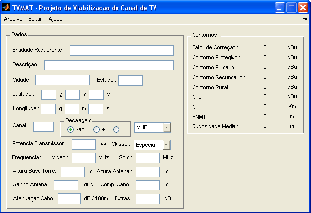
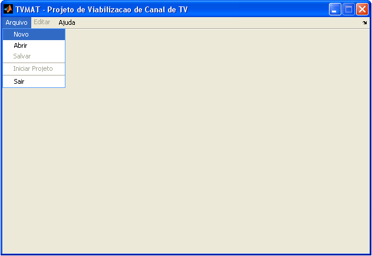
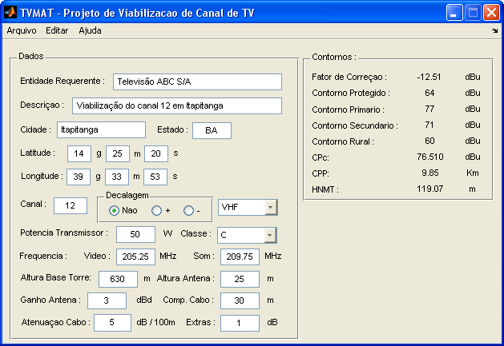
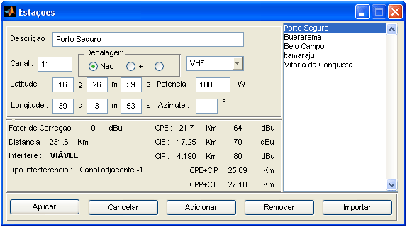
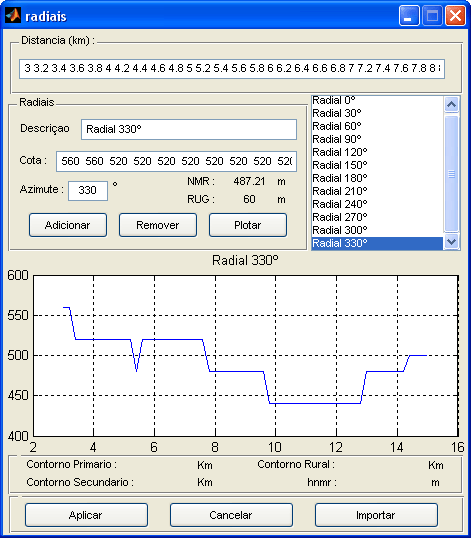

	<h1 align="center">TVMAT</h1>

  Projeto de Viabilização de Canal de TV com uso do MATLAB

 

  

> #### :rotating_light: ATENÇÃO! :rotating_light:
>A norma utilizada para elaboração deste projeto ([Regulamentação nº 284 de 7 de dezembro de 2001](https://www.anatel.gov.br/legislacao/resolucoes/2001/270-resolucao-284)) foi revogada pela [Resolução nº 721, de 11 de fevereiro de 2020](https://www.anatel.gov.br/legislacao/resolucoes/2020/1383-resolucao-721#art10). Portanto, este projeto deverá ser utilizado apenas para fins educacionais.

---

## :books: Sobre o Projeto

Este projeto foi fruto do meu de Trabalho de Conclusão de Curso (TCC) para obtenção do título de bacharel em Engenharia Elétrica com habilitação em Telecomunicações e Computação, em 2006.

O TVMAT foi desenvolvido com o propósito de facilitar a elaboração de projetos de viabilização de canal de TV analógico, antes realizados de forma manual. A elaboração de projetos deste tipo deve ser realizada por engenheiros eletrônicos/telecomunicações sempre que uma emissora de TV quiser instalar uma nova repetidora em uma localidade. Posteriormente, o projeto deverá ser encaminhado para aprovação da Anatel.

A elaboração do projeto envolve várias etapas, além de diversos cálculos e leituras de gráficos, os quais são pontos passíveis de erros.

Esta aplicação foi baseada na [Regulamentação nº 284 de 7 de dezembro de 2001](https://www.anatel.gov.br/legislacao/resolucoes/2001/270-resolucao-284), que tem como anexo o Regulamento Técnico para a Prestação do Serviço de Radiodifusão de Sons e Imagens e do Serviço de Retransmissão de Televisão. 

Este trabalho utilizou métodos de interpolação para estimar os valores das curvas de intensidade de campo, utilizadas nos cálculos de viabilização.

Uma documentação mais detalhada pode ser encontrada no documento abaixo:

[TCC TV MARCELO OLIVEIRA](TCC-TV-MARCELO-OLIVEIRA.pdf)

## :hammer_and_wrench: Tecnologias utilizadas

Esse projeto foi desenvolvido com a seguinte tecnologia:

- [MATLAB 6.5.2 R13SP2](https://www.mathworks.com/products/matlab.html)

Atualmente o MATLAB está na versão 9.9 (R2020b), de setembro de 2020. Não foram realizados testes de compatibilidade com esta nova versão.

## :gear: Executando o TVMAT

Copiar todos os arquivos da pasta /source para a pasta de trabalho (/work) do MATLAB, que por padrão é a C:\Matlab\work.
Ele deverá ser inicializado digitando-se: `tv` a partir da linha de comando do Matlab. Uma interface gráfica irá se abrir.

## :desktop_computer: Telas

<strong>Tela inicial</strong>

<strong>Exemplo de projeto</strong>

<strong>Exemplo de cadastro de estações</strong>

<strong>Exemplo de cadastro de radiais</strong>

## :memo: Licença

Este projeto está sob a licença MIT. Veja o arquivo [LICENSE](LICENSE.md) para mais detalhes.

## :loudspeaker: Citações

Este projeto foi selecionado para a fase classificatória do I Concurso Teleco de Trabalhos de Conclusão de Curso (TCC) 2005.

[https://www.teleco.com.br/tutoriais/tutorialprojcan/default.asp](https://www.teleco.com.br/tutoriais/tutorialprojcan/default.asp)

## :mailbox: Contato

Marcelo Camera - mcamera.oliveira@gmail.com

